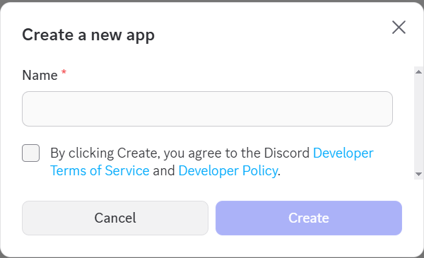
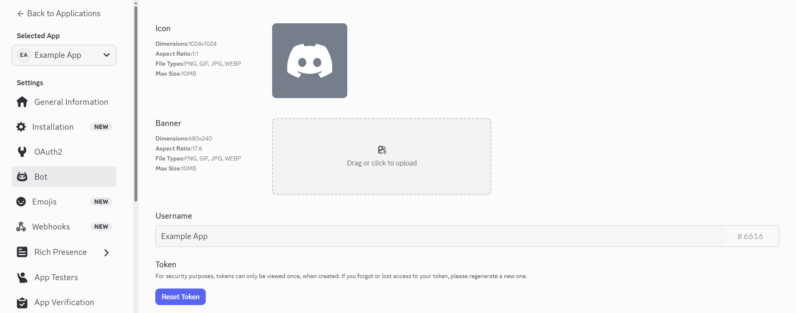
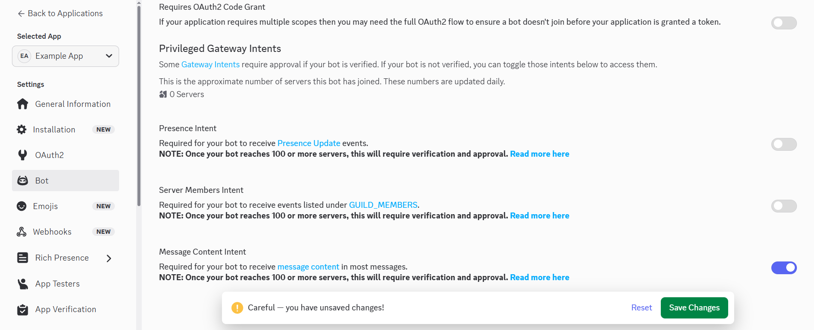
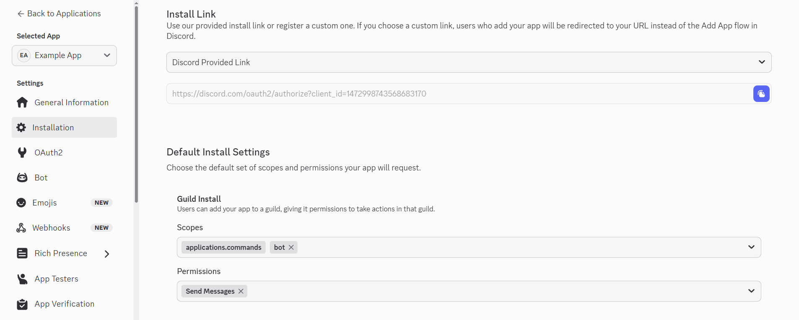
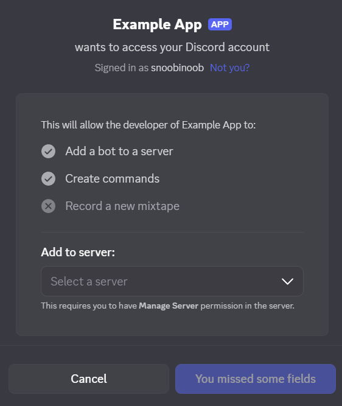

# DiscordBridge

A server-side Necesse mod that syncs in-game chat with a Discord channel

## Features

* Bidirectional chat synchronization: Discord ↔ Necesse
* Configurable forwarded message format

## Configuration

DiscordBridge settings are determined by two files; a mod config file generated by the game, and an optional text file
for overrides.

| Name                 | Default Value                       | Description                                                    |
|----------------------|-------------------------------------|----------------------------------------------------------------|
| token                | `""`                                | Authentication token of the Discord bot                        |
| channelID            | `""`                                | Discord ID of the channel                                      |
| discordMessageFormat | `[Necesse] **<author>**: <message>` | Format of messages sent to Discord (supports Discord markdown) |
| necesseMessageFormat | `[§8Discord§0] <author>: <message>` | Format of messages sent to Necesse (supports Necesse markdown) |

### Mod Config File

Necesse stores mod configuration files in specific locations depending on the operating system.

* Windows: `%appdata%/Necesse/cfg/mods/`
* Mac: `~/Library/Application Support/Necesse/cfg/mods/`
* Linux: `~/.config/Necesse/cfg/mods/`

If not present, the configuration file (snoobinoob.discordbridge.cfg) will be created when the game is first started.

This file can be edited using your favourite text editor.

### Text Override File

This overrides file (`discord_bridge.txt`) should be placed in the directory the server is started from.
Lines starting with `#` are ignored and names are case-insensitive.

```text
# Discord Bridge Example Overrides

#TOKEN = MTQ3MTI...6rxwvk
#channelID = 1471...9109
discordMessageFormat = <author>(from Necesse): <message>
necesseMessageFormat = <author>(from Discord): <message>
```

## Discord Bot Setup

In order for this mod to function, a Discord Bot needs to be set up and added to the target Discord server.

### Creating the Bot

Navigate to https://discord.com/developers/applications and click `New Application` in the top right.

Enter a name (can be changed later), agree to the policies, and click `Create`.


After being redirected to the General Information page of the new app, feel free to update the icon and description.
Then go to the `Bot` settings.


Icon, banner, and username can all be updated. Scroll down to the `Token` section and click `Reset Token`.
After confirming the token reset. Copy the newly displayed token and keep it somewhere safe.


Under the `Privileged Gateway Intents` section, enable `Message Content Intent` and save the changes.


Click on `Installation` settings, uncheck `User Install`.
Scroll down to `Default Install Settings`, add the `bot` scope, and add the `Send Messages` permission.


Copy the `Install Link` and open it in a new tab. Select the Discord server to install the app on and click `Continue`.
Ensure `Send Messages` is checked then click `Authorize`


### Configuring the Mod

As a final step, set the `bot`'s token and targeted Discord channel ID in the configuration file and start up the game.

You're all done!